Lately I've been interested in learning about embedded software; I was vaguely aware of some of the concepts (kernels, device trees, registers) but I wanted to get my hands dirty and put them into practice. So, since I own a R36S console, I set myself a concrete goal: **write a real Linux kernel driver for it and get it running end to end.**

The R36S is an **RK3326 based handheld game console running ArkOS**. The goal was an input driver, something that reads a physical button and reports it to userspace, which I thought was my best option without needing to buy any equipment.

Here are the steps it took to get something usable; including, of course, what I tripped on along the way. If you're trying to do something similar on this device or one like it, feel free to take this post as a reference point on what to do and — more importantly — what not to do.

> **Terms used throughout**
>
> - **GPIO** (General Purpose Input/Output, a pin software can read or drive).
> - **SoC** (System on Chip).
> - **ADC** (Analog to Digital Converter, turns a voltage into a number).
> - **MMIO** (Memory Mapped I/O, hardware registers that show up at memory addresses instead of a separate instruction set).
> - **IIO** (Industrial I/O, the kernel subsystem for ADCs and similar sensors).
> - **PMIC** (Power Management IC, a companion chip handling power, sometimes the power button too).
> - **DTS**/**DTSI** (Device Tree Source / Source Include, the hardware description files this whole post lives in).
> - **TRM** (Technical Reference Manual, the register-level programming datasheet vendors sometimes publish, and sometimes don't).

## What's running?

To begin, even if we know what our machine is running, it is good to check; don't just assume the latest published kernel source matches what's actually running on the device. Cross compiling a module against the wrong source tree will give us something that either won't load at all, or loads and behaves wrong — even if we don't notice at first. Everything we'll do afterwards depends on getting this right, so checking now will save us a lot of headaches in the future.

SSH into the device and ask it directly:

```bash 
uname -a
cat /proc/version
cat /etc/os-release
```

Which, for us, turned up:

```bash 
Output:
Linux rg351mp 4.4.189 #3 SMP Wed Oct 13 23:24:26 EDT 2021 aarch64 aarch64 aarch64 GNU/Linux
Linux version 4.4.189 (dev@rk3326-dev) (gcc version 6.3.1 20170404 (Linaro GCC 6.3-2017.05))
```

> **Note**
>
> To do this step — as well as most of the ones moving forwards — you will need to be able to connect your 
> R36S into the same network as your machine (**this post assumes a Linux desktop or Virtual Machine**) and then  
> connect into the handheld via SSH with a client such as [_Putty_](https://www.ssh.com/academy/ssh/client).
>
> If your machine doesn't have WiFi built-in or you are having trouble connecting, I recommend you check the 
> following posts:
> - [R36S Wi-Fi Setup Guide](https://r36s.org/articles/guide-wifi-setup).
> - [dov/r36s-programming](https://github.com/dov/r36s-programming).

This result tells us two things. The **hostname reads `rg351mp`, not `r36s`, even though this is genuinely an R36S**. This is normal, because ArkOS ships one shared image across the whole [RK3326 family](https://handheldwiki.com/chip/rockchip-rk3326/), since they're all built on the same silicon. And the other, more useful, information: **the GCC version string, `6.3.1 20170404 (Linaro GCC 6.3-2017.05)`**. That string is the key to finding the right toolchain later, and it's worth grabbing now rather than guessing later.

## Environment set up and dead links

With the GCC string in hand, finding the matching source tree was mostly a matter of checking ArkOS's own GitHub wiki, which pointed to christianhaitian/linux, branch rg351. A [community mirror](https://github.com/lcdyk0517/arkos.bsp.4.4) of the same tree had build instructions that named the exact toolchain: `gcc-linaro-6.3.1-2017.05-x86_64_aarch64-linux-gnu, hosted at releases.linaro.org`.

```bash
sudo mkdir -p /opt/toolchains &&\
wget https://releases.linaro.org/components/toolchain/binaries/6.3-2017.05/aarch64-linux-gnu/gcc-linaro-6.3.1-2017.05-x86_64_aarch64-linux-gnu.tar.xz &&\
sudo tar Jxvf gcc-linaro-6.3.1-2017.05-x86_64_aarch64-linux-gnu.tar.xz -C /opt/toolchains/
```

That URL doesn't work anymore. `wget` against it returns a 301 redirect to a generic Linaro contact page, and if you're not paying attention, which I wasn't, you'll happily "download" an HTML file and try to `tar` it, which fails with `File format not recognized`. Checking the actual file size after any download like this is an easy way to know, a toolchain archive should be over 57KB.

How do we solve this then? Well, we are in luck! This specific Linaro build turns out to be a popular one, reused across several unrelated Rockchip SoC product lines, so it's mirrored, already extracted, as a few plain GitHub repositories. Cloning one of those directly (no tarball, no extraction step needed) gets us a working toolchain:

```bash
sudo git clone --depth=1 https://github.com/rockchip-android/gcc-linaro-6.3.1-2017.05-x86_64_aarch64-linux-gnu.git /opt/toolchains/gcc-linaro-6.3.1-2017.05-x86_64_aarch64-linux-gnu
``` 

> **Note** 
>
> Don't pin a specific `-b branchname` unless you've actually checked what branch that particular
> mirror uses, different forks named their default branch differently despite holding identical 
> content. Cloning without `-b` just checks out whatever the repo's own default is.

Now, we set up the environment:

```bash
export ARCH=arm64
export CROSS_COMPILE=aarch64-linux-gnu-
export PATH=/opt/toolchains/gcc-linaro-6.3.1-2017.05-x86_64_aarch64-linux-gnu/bin/:$PATH
aarch64-linux-gnu-gcc -v
```

The last line of that output should read exactly: `gcc version 6.3.1 20170404 (Linaro GCC 6.3-2017.05)`. If it doesn't, we've got ourselves a toolchain that doesn't match, that mismatch may produce a kernel that builds cleanly but fails module version checks on the device later. We should check on another repository or branch to see find the proper one.

> **Note**
>
> If an export `PATH=...` in the same shell session is written without the trailing `:$PATH`, it will silently 
> replace all of `PATH` instead of extending it wiping out `/usr/bin`, `/bin`, and even `sudo`.
>
> I suggest putting these three exports in `~/.bashrc` once, rather than retyping them every session.

> **Further Reading**
>
> I couldn't find this exact technique, matching a device's own `uname -a`/GCC string before building anything, 
> written up in one canonical guide, but it seems to be an established practice across several separate 
> embedded communities.
>
> The [Android Build Kernel Modules how to](https://source.android.com/docs/setup/build/building-kernels) states 
> the principle directly for Android devices; 
> the [Linux Kernel Module Programming Guide](https://sysprog21.github.io/lkmpg/#building-modules-for-a-precompiled-kernel) 
> covers `modinfo/vermagic` verification. Threads showing the failure mode this step avoids: 
> an [NXP community forum thread](https://community.nxp.com/t5/i-MX-Processors/Linux-kernel-vermagic-not-corresponding/m-p/242920?profile.language=en) 
> and an [OpenWrt forum thread](https://forum.openwrt.org/t/build-official-release-with-minimal-kernel-fix-kernel-vermagic-mismatch/18562/7) ([s](https://forum.openwrt.org/t/build-image-with-official-kernel-vermagic-without-building-all-kmods/156921)), 
> both a vermagic mismatch.
>
> ArkOS's own [GitHub wiki](https://github.com/christianhaitian/arkos/wiki) and the [`christianhaitian/linux`](https://github.com/christianhaitian/linux) kernel fork itself were the actual entry points for 
> this specific board.

## Build the kernel

Before writing any driver code, the goal here was proving the whole pipeline works, source, toolchain, build, end to end, against the kernel, with nothing custom yet.

```bash
git clone -b rg351 https://github.com/christianhaitian/linux.git
cd linux
export ARCH=arm64
export CROSS_COMPILE=aarch64-linux-gnu-
make rg351p_tweaked_defconfig
make -j$(nproc) Image modules dtbs
```

I stumbled upon **some build failures** here from building an old kernel tree on a modern build machine. I'll leave them here in case you cross paths with any of them:

- **Missing `fs/exfat/Kconfig`**. The tree references an exfat filesystem driver pulled in as a git submodule, which wasn't initialized on a shallow clone. Fixed with `git submodule update --init --recursive`.
- **Build scripts use `python`, not `python3`**. This kernel's build scripts (`kernel/bounds.s`, `scripts/mod/empty.o`, and others) invoke `python` by name. Modern Ubuntu only ships `python3` by default, no python symlink. Create it with `sudo apt-get install python-is-python3`.
- **Missing OpenSSL headers**.The file `scripts/extract-cert.c`, part of the module signing infrastructure, which we don't even need, fails to compile without `libssl-dev`. Fixed with `sudo apt-get install libssl-dev`.
- **32 bit compatibility packages don't resolve on a fresh 64 bit only install**. The dependency list includes `libc6-i386`, `lib32stdc++6` and `zlib1g:i386`. On a system that's never had 32 bit support enabled, these simply won't install until we run: `sudo dpkg --add-architecture i386 && sudo apt-get update`.

Once the build actually completes, let's check it by comparing the built kernel's version string against the device's:

```bash
cat include/config/kernel.release
Output: 4.4.189
```

Success! An exact match to the device's `uname -a`, with no `-dirty` suffix or anything else appended. Now we have confirmed that the source tree, defconfig, and toolchain were all correct.

## Hello module

Before writing anything that has to do with hardware, a bare `printk`, _Hello World_-kind of module helps us verify the entire chain: cross compile, transfer, load — once again. We create the following ***C*** file.

```c
#include <linux/module.h>
#include <linux/kernel.h>
#include <linux/init.h>

static int __init hello_init(void)
{
    printk(KERN_INFO "hello_module: loaded\n");
    return 0;
}

static void __exit hello_exit(void)
{
    printk(KERN_INFO "hello_module: unloaded\n");
}

module_init(hello_init);
module_exit(hello_exit);
MODULE_LICENSE("GPL");
```

With a ***Makefile*** like:

```Makefile
obj-m += hello.o

KDIR := $(HOME)/linux
PWD := $(shell pwd)

all:
	$(MAKE) -C $(KDIR) M=$(PWD) modules

clean:
	$(MAKE) -C $(KDIR) M=$(PWD) clean
```

Built against the now-configured kernel tree, on the modules directory we run:

```bash
make
```

Transferred with scp:

```bash
file hello.ko
scp hello.ko ark@192.168.1.50:~/
```

> **Note**
>
> We can get the handhelds's IP either when _Enabling Remote Services or on the _WiFi Settings_.

Then:

```bash
sudo insmod hello.ko
dmesg | tail -5
sudo rmmod hello
```

We expect to see "hello_module: loaded" and then "hello_module: unloaded" in `dmesg` as proof everything works together.

> **Note**
>
> This happened to me, so I'm going to point it out just in case. Unlike what you might be used to,
> writing `printk(KERN_INFO, "message\n")` with a comma is wrong, producing a too many arguments for
> format [-Wformat-extra-args] warning. KERN_INFO isn't a function argument, it's meant to concatenate 
> directly onto the format string as one literal `printk(KERN_INFO "message\n")`.

## Finding the board's device tree

GPIO pins and other peripherals are wired in ways fixed at hardware design time, so something has to tell the kernel what's physically connected and to what. And that something is the device tree: a `.dts` (or shared `.dtsi`) source file, compiled by `dtc` into a `.dtb` binary the bootloader hands to the kernel at boot. We can see the `.dts` files on our Linux kernel by searching for the board name on the kernel's directory:

```bash
find . -iname "*rg351*" -path "*dts*"
```

Now, after filtering out a lot of noise, since a kernel build directory fills up with `.dtb`, `.dtb.cmd`, and `.dtb.dts.tmp` build byproducts that clutter a naive find, we find the board's file: `arch/arm64/boot/dts/rockchip/rk3326-rg351mp-linux.dts`.

We can now look inside this file for the `gpio-keys`, greping will help us find the line range in which we might encounter them:

```bash
grep -n "gpio-keys" arch/arm64/boot/dts/rockchip/rk3326-rg351mp-linux.dts
Output: 24:     compatible = "gpio-keys";
```

Now we know that they must be somewhere after the line 20-ish. So we can check the contents, on a range starting there (you might need to play with the range a bit):

```bash
sed -n '24,200p' arch/arm64/boot/dts/rockchip/rk3326-rg351mp-linux.dts
```

A device tree node looks roughly like this:

```
gpio-keys {
    compatible = "gpio-keys";
    button00 {
        label = "GPIO BTN-VOLUP";
        linux,code = <KEY_VOLUMEUP>;
        gpios = <&gpio2 RK_PA0 GPIO_ACTIVE_LOW>;
    };
};
```

Let's look at the shape of the example node. `compatible` is the string a driver's own `of_match_table` matches against at boot, it's the link between a device tree node and the ***C*** code. `gpio2` here is a label, a name defined elsewhere that this node references by pointer handle (`&gpio2`), pointing at the actual GPIO controller node this button's pin lives on. `RK_PA0` is a macro (from `dt-bindings/pinctrl/rockchip.h`) meaning "port A, pin 0" on that controller.

> **Further reading**
>
> - [Linux and the Devicetree](https://www.kernel.org/doc/html/latest/devicetree/usage-model.html), the in-kernel documentation on how Linux actually consumes this data at boot.
> - eLinux's [Device Tree Usage](https://elinux.org/Device_Tree_Reference) page, more example driven, referenced directly from the kernel doc above as the canonical overview of the format itself.

## Picking a target
### Switch mapping

The board's `.dts` contains an ASCII art comment mapping every switch (sw1 through sw22) to its physical position, D-pad, face buttons, shoulder buttons, all laid out spatially, alongside a `gpio-keys-polled` node with a real child node per switch, each with label, gpios, and linux,code.

||
|:-:|
|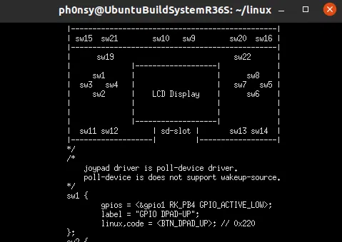|
|Diagram of button layout found within `.dts`.|

One commented entry stood out:

```
/*sw14 {
    gpios = <&gpio2 RK_PA5 GPIO_ACTIVE_LOW>;
    label = "GPIO F6";
    linux,code = <BTN_TRIGGER_HAPPY6>;
};*/
```

A known pin with the hardware wiring but disabled in software. Seems like a good candidate for our driver; one we should check, either way. `evtest` reads from `/dev/input/event*`, the kernel's raw keycodes, with nothing in between (like SDL input layer). Pressing every button and combination while watching for `BTN_TRIGGER_HAPPY6` turned up nothing. F6 is not disabled, it just isn't there at all.

With that we rule out F6 as an option. Looking now for the SELECT/START pair, we could guess they are sw9/sw10 from their position in the ASCII diagram, but that turns out to be wrong. Neither switch number appeared anywhere in the gpio-keys-polled node. A `grep` across the file eventually turned up a second, separate, plain (non-polled) gpio-keys node entirely:

|||
|:-:|:-:|
| 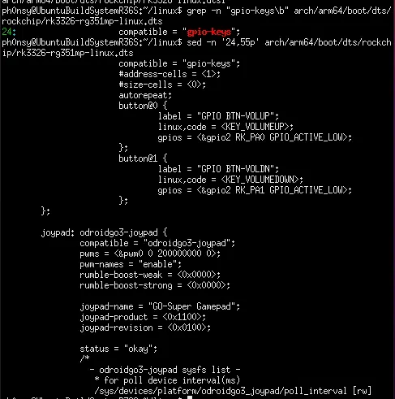 | 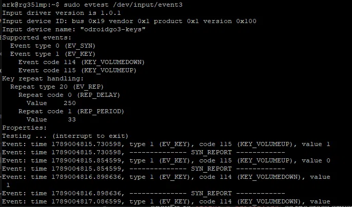 |
| Volume up, volume down and odroigo3 joypad. | `evtest` to for volume keys. |

We find volume up and down, on a completely different binding style. Checking with `evtest` shows a device named `odroidgo3-keys` reporting `KEY_VOLUMEUP`/`KEY_VOLUMEDOWN`. It seems, on this device, the driver reports volume.

> **Further reading**
>
> The `gpio-keys` device tree binding is the formal schema behind the two node styles (interrupt-driven 
> `gpio-keys` versus timer-driven `gpio-keys-polled`) that caused the confusion here. This was pointed out
> thanks to [evtest](https://man.archlinux.org/man/evtest.1).
>
> 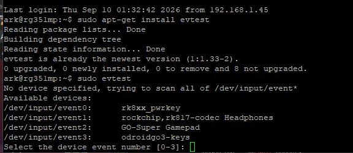
> 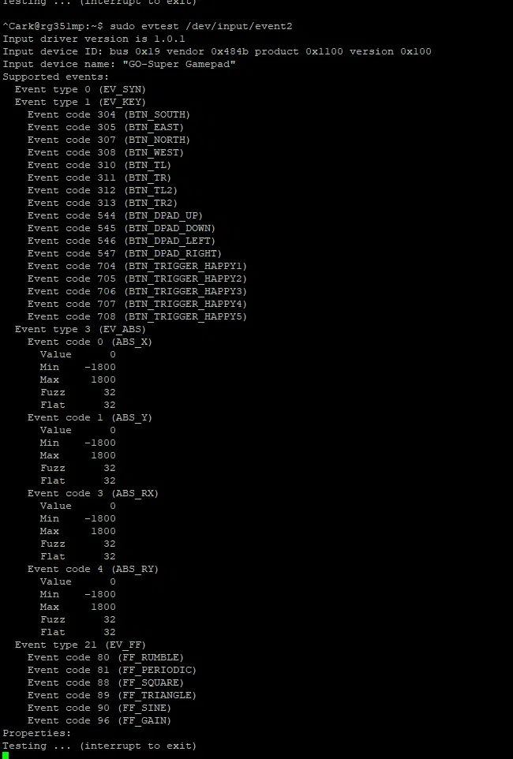

### RK3326 is derived from PX30

With F6 ruled out, since it's unavailable, we pivot into reading an already populated pin, alongside the driver that owns it. That required real register addresses, and the board's `.dts` didn't define them directly, `&gpio2` is just a label reference.

Tracing the include chain: `rk3326-rg351mp-linux.dts` includes `rk3326.dtsi`, which includes `px30.dtsi`. It seems the RK3326 and Rockchip's PX30 are pin and peripheral compatible variants built on the same base silicon. So GPIO bank definitions live in `px30.dtsi` and `rk3326.dtsi` is a wrapper on top.

||
|:-:|
| 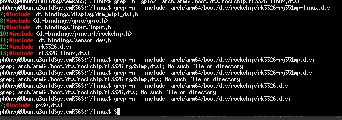 |
| Include chain. | 

||
|:-:|
| 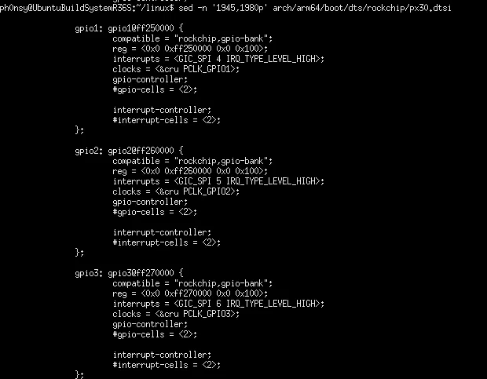 |
| gpio1, gpio2 and gpio3 physical addresses. |


That's the physical base address. The relevant register offsets within that bank, `GPIO_SWPORT_DR` (0x00, output data), `GPIO_SWPORT_DDR` (0x04, pin direction), and critically `GPIO_EXT_PORT` (0x50, the live input pin state, regardless of configured direction), came from grepping the kernel's `drivers/pinctrl/pinctrl-rockchip.c` — the driver which is using them. 

||
|:-:|
|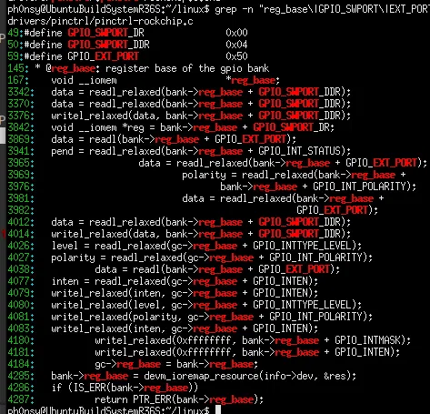|
|Pin control in file.|

> **Further reading** 
>
> Public datasheets for the [RK3326](https://rockchip.fr/RK3326%20datasheet%20V1.1.pdf) 
> and the [PX30](https://macrogroup.ru/upload/iblock/591/70wwf0x81arsuognouwz631cycd913va/PX30.pdf), 
> show the pin naming used on this project (GPIO2_A0, GPIO2_A1, and so on). However, neither has a register-level 
> memory map, nor base addresses, nor bit offsets. That gap is why the actual offsets still had to come 
> from `drivers/pinctrl/pinctrl-rockchip.c`.
>
> The three offsets found in that driver (0x00, 0x04, 0x50) match a publicly documented, well established, 
> widely used register layout. [Intel's own FPGA SoC docs](https://www.intel.com/content/www/us/en/programmable/hps/agilex5/topics/addressblock_GPIO0_summary.html) describe an identical _"DW_apb_gpio"_ address block with the same 
> three offsets under the same names, and the same layout shows up independently in FreeBSD's `dwgpio` driver, U-Boot's `dwapb_gpio.c`, and iPXE's GPIO driver, none of which have anything to do with Rockchip.

## Reading the register

With the address in hand, we can now do `ioremap()` plus `readl()`. We can't really use physical addresses directly with a pointer, we instead use `ioremap(phys_addr, size)` to ask the kernel to set up a virtual mapping for a specific physical range, returning a `void __iomem *`, a pointer type that prevents it being dereferenced like normal memory. `readl()` is the correct accessor, it handles the ordering and caching semantics memory-mapped I/O needs that plain memory doesn't. With this, our ***C*** driver code becomes:

```C
#include <linux/module.h>
#include <linux/kernel.h>
#include <linux/input.h>
#include <linux/io.h>

#define GPIO2_BASE              0xff260000
#define GPIO_MAP_SIZE           0x100
#define GPIO_EXT_PORT_OFFSET    0x50

static void __iomem* gpio;

static int __init simple_input_init(void)
{
    u32 ext_port;

    gpio = ioremap(GPIO2_BASE, GPIO_MAP_SIZE);
    if (!gpio)
    {
        printk(KERN_ERR "r36s_simple_input: ioremap failed.\n");
        return -ENOMEM;
    }
    printk(KERN_ERR "r36s_simple_input: LOADED\n");
    ext_port = readl(gpio + GPIO_EXT_PORT_OFFSET);
    printk(KERN_INFO "r36s_simple_input: %d.\n", ext_port);
    return 0;
}

static int __exit simple_input_exit(void)
{
    printk(KERN_ERR "r36s_simple_input: UNLOADED\n");
    iounmap(gpio);
}

module_init(simple_input_init);
module_exit(simple_input_exit);
MODULE_LICENSE("GPL");
```

We go for raw register read, coexisting with the built-in driver, rather than an interrupt handler or a new device tree node claiming the pin exclusively, because the `gpio-keys`/`gpio-keys-polled` drivers already own interrupt and GPIO-line-request rights on every populated pin. GPIO_EXT_PORT is a passive register reflecting the pin's current electrical state, two independent readers peeking at the same passive state never conflict. 

This means only polling, each `read()` from userspace being a live snapshot at that exact instant. There is a big limitation we have to take into account for this approach: a press shorter than the gap between two reads can be missed entirely.

> **Note**
>
> We can check how `ioremap()` is used on included drivers by running:
>
> ```bash
> grep -rn "= ioremap(" drivers/gpio/*.c | head -10
> ```
>
> Which will point us to multiple files and lines. We can further investigate by using: 
>
> ```bash
> sed -n '605,615p' drivers/gpio/gpio-pxa.c
> ```
> ||
> |:-:|
> |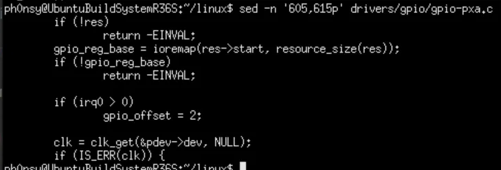|
> |`ioremap()` usage inside `gpio-pxa.c`. |
 
> **Further reading** 
>
> [`Documentation/input/input-programming.rst`](https://github.com/EOS-team/EOS/blob/40c8096ed6603bf0a2e256d4d594a56048765c4c/src/RROS/Documentation/input/input-programming.rst),
> in the kernel source tree itself, covers the `input_dev/input_report_key/input_sync` API the built-in 
> drivers on this board use, worth reading to understand both sides of the deliberate difference between 
> this project's approach and theirs.

## Testing on R36S

We check if the value changes depending on input. To check just that, we read the register once with nothing held, unload the module, physically hold a button, reload the module while still holding it, and compare.

Baseline:

```bash
sudo insmod simple_input.ko
dmesg | tail -3
Output: r36s_simple_input: UNLOADED
        r36s_simple_input: LOADED
        r36s_simple_input: 7327999 

python3 -c "print(7327999 & 0x3)"
Output: 3
```

While holding volume down:

```bash
sudo insmod simple_input.ko
dmesg | tail -3 
Output: r36s_simple_input: UNLOADED
        r36s_simple_input: LOADED
        r36s_simple_input: 7196925 
        
python3 -c "print(7196925 & 0x3)"
Output: 1
```

Both are `GPIO_ACTIVE_LOW`, so bit 0 (volume up) and bit 1 (volume down) both being 1 at rest means both are electrically high — unpressed. Masking the two low bits of each raw reading with `python3 -c "print(number & 0x3)"`:
- **Before touching the device**: gives us 3 (binary 11, both unpressed).
- **Holding volume down**: gives us 1 (binary 01, only the untouched bit still set). 

Once we know this works on one bank, we can scale to all three GPIO banks the board uses (_gpio1_ at 0xff250000, _gpio2_ at 0xff260000 and _gpio3_ at 0xff270000), covering all 20 real buttons: D-pad, face buttons, volume, four F-row buttons, both shoulder pairs, and the two stick-click switches (F3 / F4, which we checked via evtest to be `BTN_TRIGGER_HAPPY3` / `HAPPY4` when the stick is clicked down).

> **Note**
> 
> A little thing to keep in mind. This kernel builds under the older ***GNU89*** dialect, which requires every 
> variable declaration at the very top of a block, before any executable statement. Declaring `u32 val = readl(...);`
> partway through a function will give us a compile error.

## Design: Pull vs. Push

Now that we can read the three banks, we move onto interface design. Initially, I thought about a background kernel timer continuously refreshing a cached value, supporting blocking `read()` / `poll()` calls. 

So, what's the tradeoff here exactly? On one hand, a live register read on demand (the _"pull"_ model) always reflects the true state **only** at the exact moment it's called; while, on the other hand, a cached value refreshed on a timer (the _"push"_ model) is, at best, however old the last tick was. 

The limitation is easy to work out: a press shorter than the sampling interval behaves identically in both designs; it comes with polling itself, regardless of when the polling happens. Given that, and given this driver's actual purpose (poll-on-demand monitoring, not a real-time input pipeline), the simpler _pull_ design seems more sensible (a push design would mean: no timer, no spinlock, no wait queue, each `read()` does one live register read and returns).

Now it's all about building the final 20 button bitmask and flipping raw value so that 0 means inactive and 1 active. Check the actual implementation [here](https://github.com/ph0nsy/r36s-simple-input/blob/main/simple_input.c).

> **Note**
>
> One idea from the time I was thinking on doing stick support: normalized analog stick values as float fields
> in the shared struct.
> 
> The kernel avoids floating point almost entirely, it doesn't routinely save and restore FPU register state on
> register state on every context switch, since doing so for code that will never need it would be wasted overhead. 
> Using a float without the explicit, architecture-specific save/restore wrapper functions risks corrupting an
> unrelated userspace process's floating point state. 
>
> What we should have done is fixed-point integers (an int16_t representing a scaled range, with the true value 
> computed as raw / 32768.0 in userspace, where floats are free to use). 

## The analog sticks problem

Since the buttons seem to be working, the next thing is to check whether we can apply the same shadow-read approach to the analog sticks. In short: no, we can't. Now, I'll walk you through my little investigation into why.

`evtest` checks on the joypad device shows `ABS_X`/`ABS_Y`/`ABS_RX`/`ABS_RY`, each between -1800 and 1800, which doesn't look like a GPIO pin state. This comes from the ADC (`saradc`), not from any GPIO bank. Reading through `drivers/input/joystick/odroidgo3-joypad.c` gives us a hint: a shared ADC channel (`devm_iio_channel_get(dev, "amux_adc")`) with an analog multiplexer in front of it, electrically switching which stick axis's voltage actually reaches that one ADC input. 

||
|:-:|
|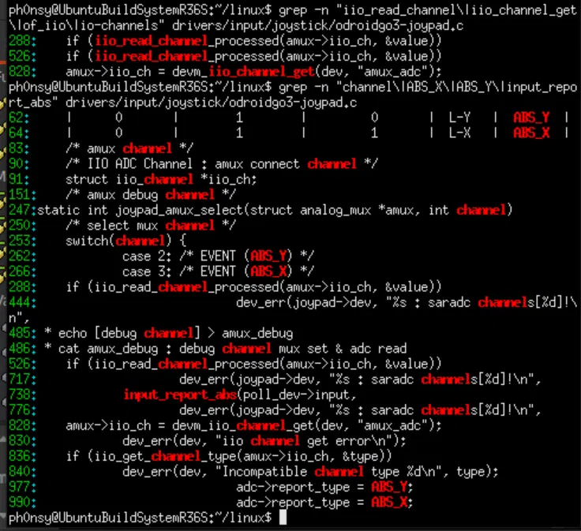|
|`grep` of `odroidgo3-joystick.c`.|

Three separate GPIO lines control that mux (`amux-a-gpios`, `amux-b-gpios`, `amux-en-gpios`; which we can check on the board's `.dts`, all on _gpio3_), and the driver's own code (`gpio_direction_output(amux->sel_a_gpio, 0)`) explicitly configures and drives them as outputs.

||
|:-:|
|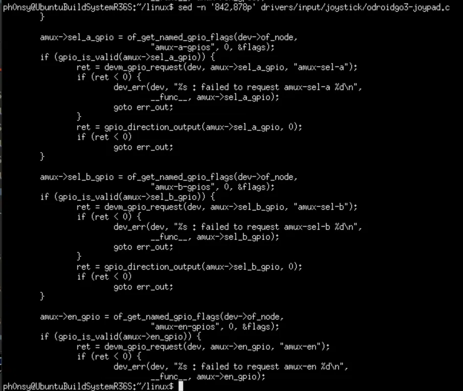|
|GPIO controlled multiplexer.|

With this we know the drivers can't coexist. Buttons worked as a safe shadow read because GPIO_EXT_PORT is on a read-only-safe state: nothing is writing it, so no read of it can conflict with another. Sticks require actively writing to the same mux select lines and the same ADC control register the built-in driver is already writing to continuously; we know as much since the `odroidgo3-joypad` node screenshotted back when we were [_Picking a target_](#picking-a-target) exposes a `poll_interval sysfs` attribute, defined in the comment as controlling the poll device's interval in milliseconds: the driver is on a running polling loop. Two independent writers racing on the same control register and mux lines isn't a safe read-only shadow. It runs the risk of corrupting the built-in driver's stick output for whatever's actually consuming them (RetroArch, EmulationStation, anything reading `ABS_X`/`ABS_Y`).

With that, the sticks are scoped out of this project: a non-invasive shadow implementation seems structurally dubious here without either replacing the built-in driver outright or building cross-driver coordination.

## Where does this leave us?

We've gotten ourselves all 20 GPIO-backed buttons (D-pad, face buttons, volume, F1 through F5, both shoulder pairs, both stick clicks), working and checked, packed into a single 32-bit bitmask exposed through `/dev/r36s_simple_input`, running alongside every other input driver already on the device. 

> **Note**
>
> Let me give you an example of that last point that I stumbled upon in this very project. When we flip the bits to
> make 0 inactive and 1 active when testing on volume buttons, I used `val = (-val) & 0x3;` instead of `val = (~val) & 0x3;`.
> This can easily slip through the cracks since the value you get is what you'd half expect. Testing with
> `python3 -c "print(number & 0x3)"` the original value received and comparing with val shed some light into the
> fact that something was not working out.

## References and Resources

- Source and README: https://github.com/ph0nsy/r36s-simple-input.
- [christianhaitian/linux](https://github.com/christianhaitian/linux), the ArkOS kernel fork this driver reads alongside.
- [Linux Device Drivers, 3rd Edition](https://lwn.net/Kernel/LDD3/) and [Bootlin's training materials](https://bootlin.com/blog/free-training-materials/), drivers and device tree explored side by side.
-  [Linux and the Devicetree](https://www.kernel.org/doc/html/latest/devicetree/usage-model.html) and eLinux's [Device Tree Usage](https://elinux.org/Device_Tree_Reference) page for the device tree format itself.
- The IIO driver-api documentation for the ADC subsystem behind the analog sticks.
- More general tutorial guides on [Linux Device Drivers](https://medium.com/@mwafa2sh/write-your-own-linux-device-driver-6996ccb815db) and [`ioremap()`](https://medium.com/@techdhaba.training/%EF%B8%8F-ioremap-the-memory-mapping-magic-that-makes-hardware-access-possible-3e23316984a8).